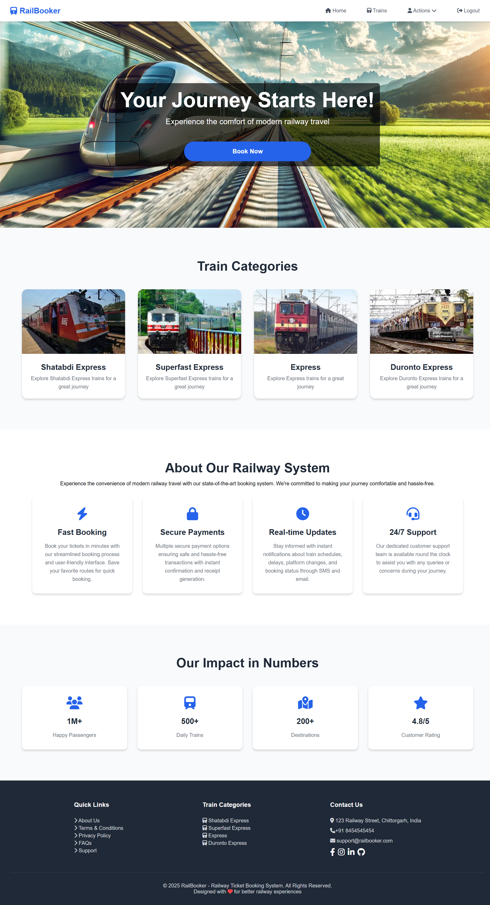
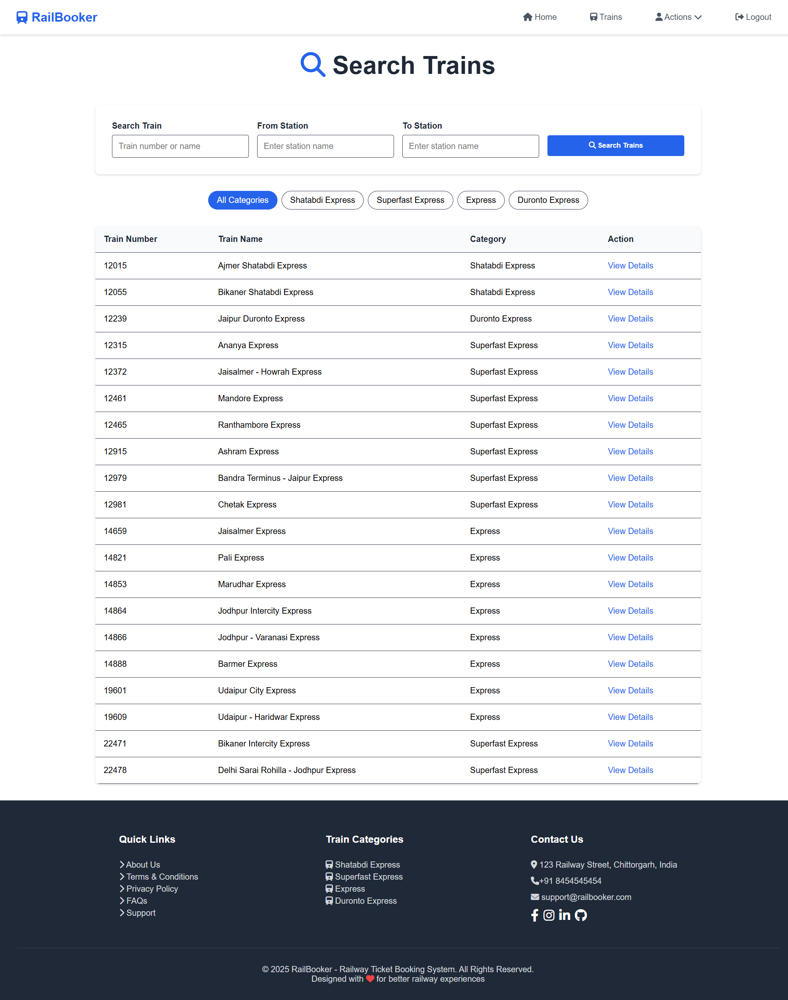
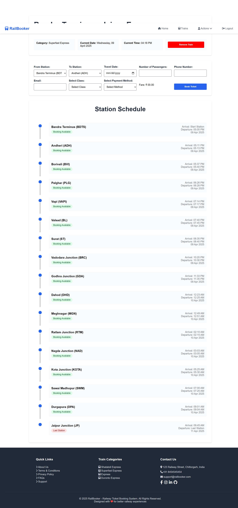
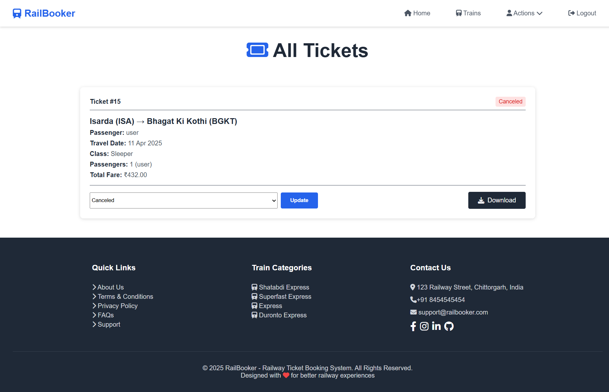

# 🚆 RailBooker - Railway Reservation System

**RailBooker** is a web-based Railway Reservation System that allows users to view train information, book tickets, and manage their profiles. The system also includes an admin interface to manage train listings.


🗝️ **Admin Credentials**: ```gmail: admin@gmail.com password: 123```

---

## ✨ Features

- 🔐 **User Authentication** – Secure login and logout
- 🚄 **Train Listings** – Browse all available trains
- 📄 **Train Details** – Detailed view of each train
- 🎟️ **Ticket Booking** – Reserve seats for trains
- 👤 **User Profile** – Manage personal details
- 🛠️ **Admin Panel** – Add or manage train data

---

## 🛠️ Technologies Used

- **Frontend**: HTML, CSS, JavaScript
- **Backend**: PHP
- **Database**: MySQL
- **Server**: Apache (via XAMPP/WAMP)

---


## 🚀 Usage

- Browse trains from the homepage
- Log in to view profile or book tickets
- View train details by clicking on a train
- Use the ticket form to make bookings
- Admin can add new trains via the admin page

---

## 📸 Screenshots

**Homepage**  


**Train Listings Page**  


**Train Details Page**  


**Ticket Booking Page**  



## 📁 Project Structure

```
.
├── index.php              # Homepage
├── login.php              # User login
├── logout.php             # Logout script
├── profile.php            # User profile
├── tickets.php            # Book tickets
├── train-details.php      # Train details
├── trains.php             # Train listings
├── add_train.php          # Admin: Add train
├── railway.sql            # Database schema
│
├── assets/                # Static images
├── css/                   # Stylesheets
├── script/                # JavaScript files
├── include/               # PHP logic, components
│   ├── db.php             # DB connection
│   ├── nav.php, footer.php
│   └── *_*.php            # Logic handlers
```
